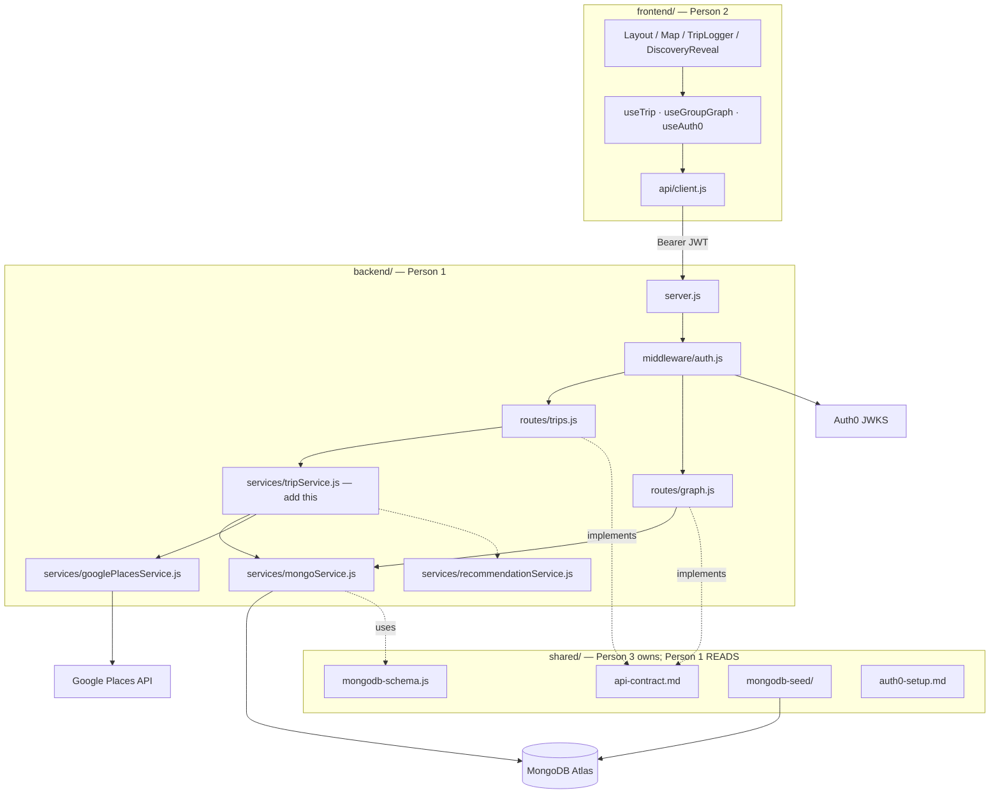
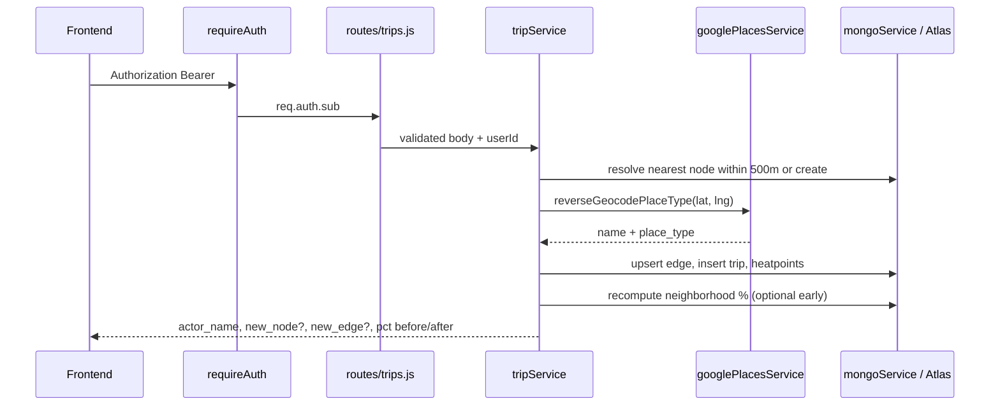

# Drift Backend Architecture

**Audience:** Person 1 (backend lead)  
**Scope:** `backend/` only — do not edit `frontend/` or `shared/` without team agreement.  
**Baseline:** Live template stubs in this repo + `shared/api-contract.md` + `shared/mongodb-schema.js`.

Read-only references:
- `shared/api-contract.md` (DRAFT until Person 1 + 2 lock it)
- `shared/mongodb-schema.js` (collection names, enums, indexes)
- `shared/auth0-setup.md`
- `shared/atlas-setup.md`

---

## System context



---

## Template inventory (what exists today)

| Piece | State |
|---|---|
| `src/server.js` | Boots, CORS, JSON, mounts routes, tries Mongo on start |
| `src/middleware/auth.js` | Checks `Bearer` prefix only — no JWKS yet |
| `src/routes/trips.js` | `POST /` returns **501** |
| `src/routes/graph.js` | `GET /:groupId/graph` returns **501** |
| `src/services/mongoService.js` | `connectMongo` / `getDb` / `closeMongo` ready |
| `src/services/googlePlacesService.js` | Stub returns `{ name: null, place_type: "unknown" }` |
| `src/services/recommendationService.js` | Defer — not on critical path |
| `src/models/index.js` | Placeholder |
| Dependencies | `express`, `cors`, `dotenv`, `mongodb` (native driver) |

Env (from `.env.example`): `PORT`, `MONGODB_URI`, `MONGODB_DB`, `AUTH0_DOMAIN`, `AUTH0_AUDIENCE`, `GOOGLE_PLACES_API_KEY`.

---

## Critical path: `POST /api/trips`



Contract highlights (`shared/api-contract.md`):
- Request: `group_id`, `from_lat/lng`, `to_lat/lng`, `duration_min` (5–120), `travel_mode` enum
- Success: `success`, `actor_name`, nullable `new_node` / `new_edge`, `neighborhood_pct_before` / `_after`
- Demo hero: CMU `(40.4425, -79.9435)` → Lawrenceville `(40.4501, -79.9585)`, 31 min, `bus`
- Errors: `{ success: false, error }` with 400 / 401 / 404 / 500 / 501

Also implement:
- `GET /api/groups/:groupId/graph` — nodes, edges, heatpoints, neighborhoods map

Defer:
- `GET /api/users/:userId/profile`
- `recommendationService`
- friends / user_heatpoints privacy

---

## Layering rules

| Layer | Owns | Does not own |
|---|---|---|
| `routes/` | paths, status codes, thin handlers | business rules |
| `middleware/` | JWT, shared error shape | DB / Places |
| `services/` | trip discovery, Places, graph assembly | Express `req`/`res` |
| `mongoService` + schema constants | collections, queries, indexes | HTTP |

Prefer adding `src/services/tripService.js` so `trips.js` stays a thin adapter.

Import collection names / enums from `../../shared/mongodb-schema.js` (or copy constants if path import is awkward — keep names identical).

---

## Design decisions (locked for hackathon)

1. **Sync request** — no Redis/queues. Places + writes happen in the request.
2. **Cache Places** — never call twice for the same lat/lng (rounded key or `places_cache` collection).
3. **Node resolution** — nearest existing node within ~0.5 km for that `group_id`; else create.
4. **Discovery flags drive the UI** — nullable `new_node` / `new_edge` and pct delta are sacred once the contract is locked.
5. **Auth order** — ship trip + graph logic first with stub auth (Bearer present → pass); swap JWKS validation before demo.
6. **Native MongoDB driver** — already in `package.json`; Mongoose optional, not required.

### Indexes (from schema — create early)

- `nodes`: `{ group_id, lat, lng }`, `{ group_id, place_type }`, `{ group_id, neighborhood }`
- `edges`: `{ group_id, from_node_id, to_node_id }`
- `trips`: `{ group_id, user_id }`, `{ group_id, started_at }`
- `heatpoints`: `{ group_id, lat, lng }`
- `users`: unique `auth0_id`

---

## Recommended build order

1. **Env + Mongo** — `.env` from `.env.example`; confirm `GET /` and Atlas connect. Use Person 3 seed data.
2. **`POST /api/trips`** — validate body → resolve/create nodes → upsert edge/trip/heatpoints → contract JSON. Keep stub auth for curl.
3. **`GET /api/groups/:groupId/graph`** — read path for the map.
4. **Google Places** — implement `reverseGeocodePlaceType` + cache.
5. **Auth0 JWKS** — real JWT verify via `AUTH0_DOMAIN` + `AUTH0_AUDIENCE` (see `shared/auth0-setup.md`).

**First file to replace the 501:** `src/routes/trips.js` (logic in `tripService.js`).

---

## Curl smoke tests (local)

```bash
# health
curl -s http://localhost:3000/

# trips (stub auth: any Bearer string until JWKS is live)
curl -s -X POST http://localhost:3000/api/trips \
  -H "Authorization: Bearer test" \
  -H "Content-Type: application/json" \
  -d '{"group_id":"REPLACE","from_lat":40.4425,"from_lng":-79.9435,"to_lat":40.4501,"to_lng":-79.9585,"duration_min":31,"travel_mode":"bus"}'

# graph
curl -s http://localhost:3000/api/groups/REPLACE/graph \
  -H "Authorization: Bearer test"
```

---

## Out of scope for Person 1

- Frontend components / Vite app
- Seed script ownership (Person 3) — consume seed, don't rewrite unless agreed
- Changing `shared/api-contract.md` without Slack + PR agreement with Person 2
